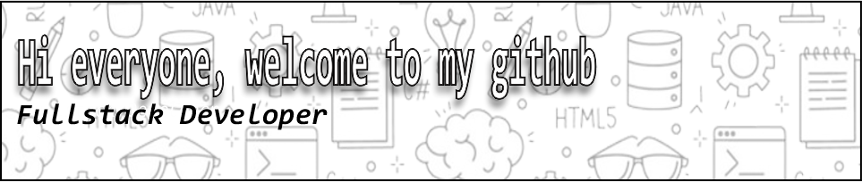

- 🌱 I’m currently learning [Laravel Framework](https://laravel.com),[Golang](https://golang.com) And Svelte

##### 🌐 Socials:

##### 💻 Tech Stack:

         

##### 📊 GitHub Stats:

 
 

##### 🏆 GitHub Trophies

##### 🔝 Top Contributed Repo

---

<h2 align="left">Play Games With Me...</h2>

###

<picture>
  <source media="(prefers-color-scheme: dark)" srcset="https://raw.githubusercontent.com/sellayspy/sellayspy/output/pacman-contribution-graph-dark.svg">
  <source media="(prefers-color-scheme: light)" srcset="https://raw.githubusercontent.com/sellayspy/sellayspy/output/pacman-contribution-graph.svg">
  
</picture>

###

###

<!-- Proudly created with GPRM ( https://gprm.itsvg.in ) -->

<!-- #### Skills

#### Connnect with me

#### My Github Stats

 -->
